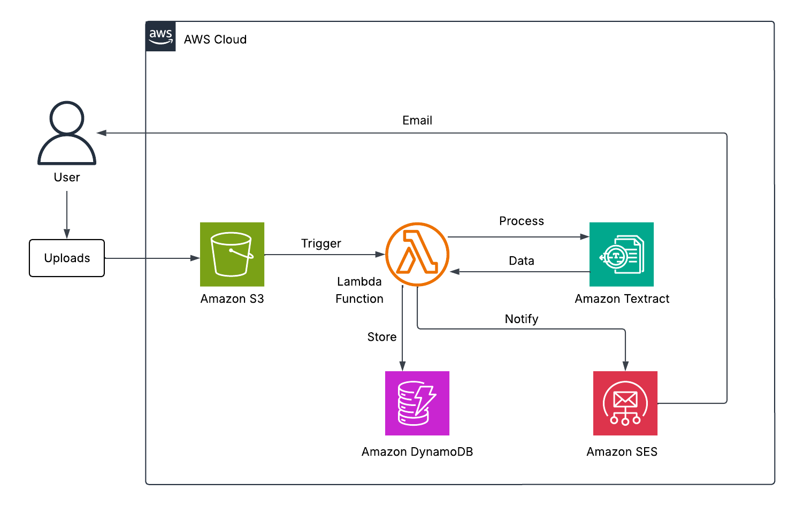
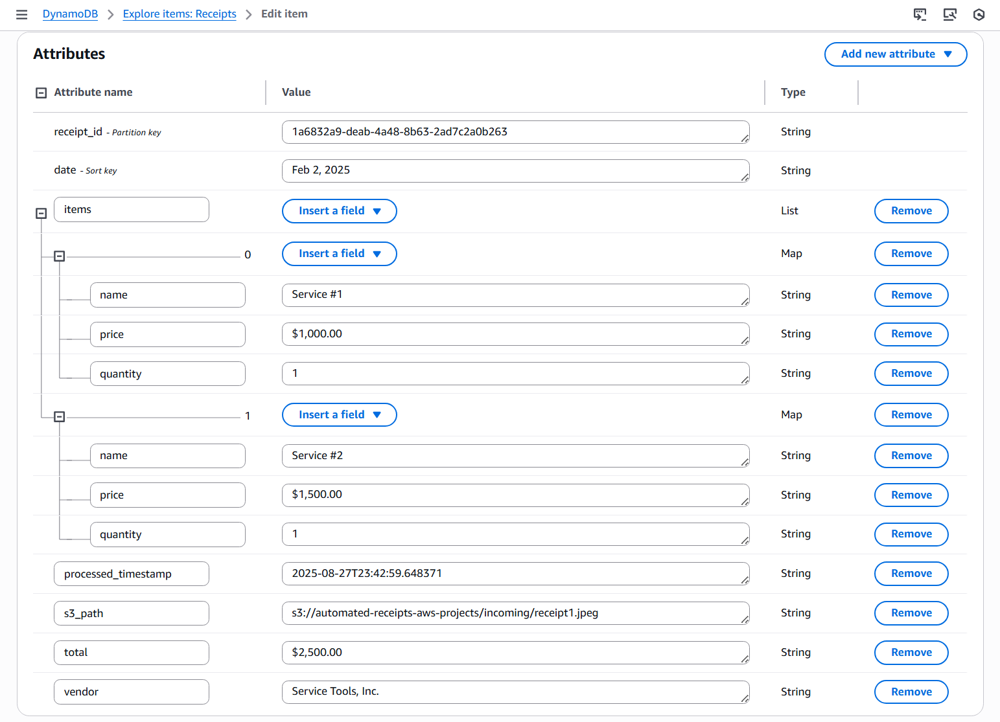

# AWS Automated Receipt Processing System
This project implements a **serverless, event-driven receipt processing pipeline** on AWS. When users upload receipt images to an S3 bucket, an automated workflow extracts key details (vendor, total amount, date, and line items) using **Amazon Textract**, persists the structured data in **DynamoDB**, and sends out **email notifications** with **Amazon SES**.  

This project demonstrates how **event-driven design patterns** work in practice and how AWS-managed services can replace traditional servers, reduce operational overhead, and scale automatically with demand.  

## Architecture Overview  
  
*Figure 1: Architecture diagram of the AWS Automated Receipt Processing System.*  

### Core Components  
- **Amazon S3** – Stores uploaded receipt images. Triggers the Lambda processor through event notifications.  
- **AWS Lambda** – Main compute layer. Uses Textract to analyze receipts, saves data in DynamoDB, and sends notifications with SES.  
- **Amazon Textract** – Extracts structured data (vendor, date, total, line items) from receipt images.  
- **Amazon DynamoDB** – NoSQL database to persist processed receipt data for querying and reporting.  
- **Amazon SES (Simple Email Service)** – Sends notification emails with extracted receipt details.  
- **IAM (Identity and Access Management)** – Provides least-privilege access between services (S3, DynamoDB, Textract, SES).  
- **AWS SAM / CloudFormation** – Deploys infrastructure and application resources as code.  

## Skills Applied  
- Designing and implementing serverless architectures.  
- Configuring event-driven triggers between AWS services.  
- Building IAM roles and policies with least-privilege access, scoped to application resources (managed policies used where practical).  
- Integrating AWS Textract for document analysis.  
- Persisting structured data in DynamoDB.  
- Automating notifications with SES.  
- Debugging and testing Lambda event-driven workflows.  

## Features  
- Processes receipt images uploaded to S3 (`incoming/` folder).  
- Extracts vendors, totals, dates, and line items using **Textract AnalyzeExpense API**.  
- Persists receipt metadata in **DynamoDB**.  
- Sends email confirmations to the user with receipt summary.  
- Provides Infrastructure as Code (SAM template) for reproducible deployment.  
 
## Tech Stack  
- **Languages:** Python 3.13  
- **AWS Services:** S3, Lambda, Textract, DynamoDB, SES, IAM  
- **IaC Tool:** AWS SAM  
- **Other Tools:** AWS CLI  

## Deployment Instructions  
> **Note:** Many commands are identical across shells; the main differences are line continuation (PowerShell: `` ` `` • Bash: `\` • cmd.exe: `^`), environment variables (PowerShell: `$env:NAME=...` • Bash: `NAME=...` • cmd.exe: `set NAME=...`), and path separators.  

> Due to CloudFormation/SAM limitations, S3 event notifications for pre-existing buckets cannot be provisioned automatically. Therefore, the S3 bucket and its event triggers must be created separately.  

> Python 3.13 is recommended and tested for this project. Ensure your PATH environment variable includes the following entries (with priority above other Python versions):  
>    - `..\Python313\`  
>    - `..\Python313\Scripts`  

### SAM  
1. Clone this repository.   
2. Navigate to the `cloudformation` folder, build, and deploy:  
    ```bash
    cd cloudformation
    sam build
    sam deploy --guided --capabilities CAPABILITY_NAMED_IAM --tags Project=aws-receipt-processing-system
    ```
4. Provide parameters when prompted (pre-existing S3 bucket name).  

> **Note**: Ensure the AWS CLI user (`aws configure`) or CloudFormation assumed role has sufficient permissions to manage **Lambda functions**, **S3**, **SES**, **DynamoDB**, and **IAM resources**.  

## How to Use  
1. **Create an S3 bucket** using the AWS Management Console.  

2. **Edit the environment variable values** in the Lambda function (**SES_SENDER_EMAIL**, **SES_RECIPIENT_EMAIL**).  

3. **Edit the environment variable values** in the SAM template (**EmailIdentity**, **SES_SENDER_EMAIL**, **SES_RECIPIENT_EMAIL**)  

4. **Deploy the infrastructure** using SAM.  

5. **Create** the `incoming/` folder in the S3 bucket.  

6. **Add S3 event notifications** to the S3 bucket: **Prefix:** incoming/, **Suffix:** *(Optional)*- .jpg, .jpeg, or .png (if adding multiple suffixes, one event for each suffix type must be created), **Event types:** All object create events, **Destination:** Lambda function, **Specify Lambda function:** Choose the newly created Lambda function.  

7. **Verify SES Email Identity** by clicking the confirmation link in the sent email.  

8. **Upload a receipt** to the `incoming/` folder in the S3 bucket.  

9. **Check the DynamoDB table** `Receipts` for extracted data.  

10. **Verify the SES email** notification with uploaded receipt metadata.  

## Project Structure  
```plaintext
aws-receipt-processing-system/
├── assets/                               # Images, diagrams, screenshots
│   ├── architecture-diagram.png          # Project architecture diagram
│   ├── dynamodb-screenshot.png           # Example DynamoDB output
│   └── email-screenshot.png              # Example email notification
├── cloudformation/                       # AWS SAM template
│   └── template.yaml                     # Main SAM template
├── src/                                  # Lambda source code
│   └── receiptprocessor_function/        # Lambda function
│       └── receiptprocessor_lambda.py    
├── LICENSE                               
├── README.md                             
└── .gitignore                            
```  

## Screenshots  
  
*Figure 2: Example DynamoDB table showing extracted receipt details.*  

  
*Figure 3: Email notification generated by the system with receipt summary.*  

## Future Enhancements  
- Add a **web form** for uploading receipts (S3 static site hosting).  
- Provide a **searchable dashboard** (e.g., using AWS Amplify + DynamoDB queries).  
- Integrate **Amazon OpenSearch** for full-text search and analytics on extracted data.  
- Add **image compression** before storage to reduce costs.  
- Configure **SNS alerts** for processing failures.  
- Track **processing status** of documents (Pending, Processed, Rejected).  
- Secure uploads with **Amazon Cognito authentication**.  

## License  
This project is licensed under the [MIT License](LICENSE).  

---

## Author  
**Patrick Heese**  
Cloud Administrator | Aspiring Cloud Engineer/Architect  
[LinkedIn Profile](https://www.linkedin.com/in/patrick-heese/) | [GitHub Profile](https://github.com/patrick-heese)  

## Acknowledgments  
This project was inspired by a course from [techwithlucy](https://github.com/techwithlucy).  
The Lambda function code is taken directly from the author's original implementation.  
The architecture diagram included here is my own version, adapted from the original course diagram.  
I designed and developed all Infrastructure as Code (SAM) and project documentation.  
